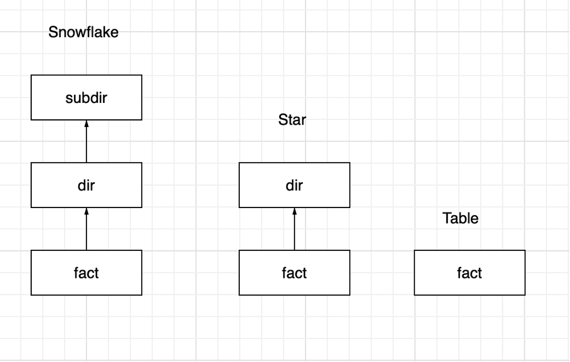
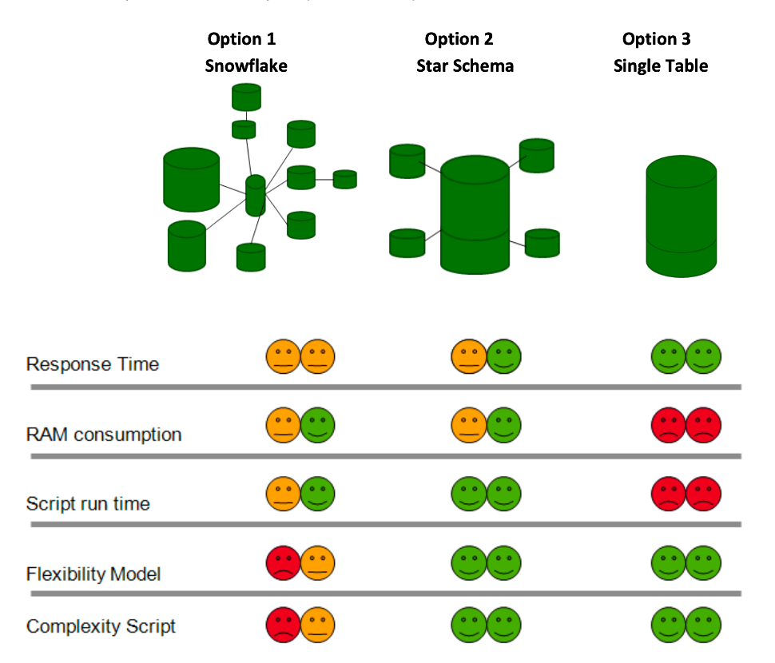

# qlik_quiz
## Вопросы и ответы
### 1. Что такое qvd optimized, благодаря чему и при выполнении каких условий включается данный режим 
[qvd optimized](https://help.qlik.com/en-US/qlikview/May2024/Subsystems/Client/Content/QV_QlikView/QVD_files.htm) – бест практика при загрузке данных из qvd средствами qlik, при которой достигается максимальная скорость.

Условия: 
- отсутствие формул для полей в скрипте загрузки, отсутствие добавления кастомных полей типа Rowno()
- отсутствие условия Where 
- допускается переименование полей
- В качестве альтернативы Where можно использовать условие    Exist

### 2. Модели данных Таблица/Звезда/Снежинка. Сравните потребление RAM и CPU на одинаковых данных 
Зависит данных, на основе которых строим модели, например если мы берем данные, относительно которых выстраиваются модели с одной таблицей фактов и небольшим (ниже в примере одним) реляционным ответвлением то Звезда Снежинка и Таблица выдадут сопоставимо схожие результаты

Рассматривая общепринятую концепцию звезда и снежинка имеют сопоставимо схожий бенчмарк, табличная модель более требовательная к ресурсам, однако имеет более быстрый отклик. В обучающих программах от Qlik рекомендуется использовать звезду как эталонный лэйаут, однако выбор модели ситуативен и зависит от задачи, данных и доступных ресурсов. Нагрузку на CPU будем считать пропорциональной RAM.

#### Материалы
[QlikView Best Practices - Development](https://www.google.com/url?sa=t&source=web&rct=j&opi=89978449&url=https://community.qlik.com/cyjdu72974/attachments/cyjdu72974/qlikview-app-development/226090/1/QlikView%2520Best%2520Practices%2520-%2520Development.pdf&ved=2ahUKEwjxueiL8oOIAxUfHBAIHS5HM9IQFnoECA4QAQ&usg=AOvVaw2JoYdIU1dVKOM-QVlz4hir)

[Picking the right data model for Qlik Sense](https://www.bitmetric.nl/blog/qlik-sense-data-modelling/)

### 3. Как хранятся таблицы в RAM в модели Qlik. Что хранится в символьных таблицах
Модель состоит из таблиц символов и таблиц данных.
Таблицы символов хранят соответствие уникального значения – символу, где символ – это ссылка на битовый указатель. Каждое уникальное значение хранится один раз.
Таблицы данных представляют из себя набор указателей которые ссылаются на значения которые хранятся в таблицах символов.

#### Материалы
[Symbol Tables and Bit-Stuffed Pointers](https://community.qlik.com/t5/Design/Symbol-Tables-and-Bit-Stuffed-Pointers/ba-p/1475369)

[Performance_and_Optimization_Best_Practices_in_Qlik_v2.pptx](https://qliksense.ivan-shamaev.ru/wp-content/uploads/2019/11/Performance_and_Optimization_Best_Practices_in_Qlik_v2.pptx?ysclid=m03hv7pjb4552648218)

### 4. В чем отличие OleDB и ODBC подключений
[ODBC](https://ru.wikipedia.org/wiki/ODBC) – разработан на основе CLI

[OLEDB](https://learn.microsoft.com/en-us/previous-versions/windows/desktop/ms722784(v=vs.85)?redirectedfrom=MSDN) – разработан на основе COM

### 5. Назовите службы Qlik Sense, опишите назначение каждой
[Qlik Sense Engine Service](https://help.qlik.com/en-US/sense-admin/May2024/Subsystems/DeployAdministerQSE/Content/Sense_DeployAdminister/QSEoW/Administer_QSEoW/Managing_QSEoW/engines-overview.htm) – сервис обрабатывающий вычисления и логику приложений Qlik

[Qlik Sense Printing Service](https://help.qlik.com/en-US/sense-admin/May2024/Subsystems/DeployAdministerQSE/Content/Sense_DeployAdminister/QSEoW/Administer_QSEoW/Managing_QSEoW/printing-overview.htm) – сервис управляющий экспортом.

[Qlik Sense Proxy Service](https://help.qlik.com/en-US/sense-admin/May2024/Subsystems/DeployAdministerQSE/Content/Sense_DeployAdminister/QSEoW/Administer_QSEoW/Managing_QSEoW/proxies-overview.htm ) – сервис управляющий аутентификацией сайта, обработкой сессий и балансировкой 

[Qlik Sense Scheduler Service](https://help.qlik.com/en-US/sense-admin/May2024/Subsystems/DeployAdministerQSE/Content/Sense_DeployAdminister/QSEoW/Administer_QSEoW/Managing_QSEoW/schedulers-overview.htm ) – планировщик задач перезагрузки приложений, задач синхронизации пользователей.

[Qlik Sense Repository Service](https://help.qlik.com/en-US/sense-admin/May2024/Subsystems/DeployAdministerQSE/Content/Sense_DeployAdminister/QSEoW/Administer_QSEoW/Managing_QSEoW/repositories-overview.htm#:~:text=The%20Qlik%20Sense%20Repository%20Service,to%20serve%20Qlik%20Sense%20apps.) – сервис управляет сохранением и синхронизацией приложений Qlik, лицензированием, безопасностью, данными конфигурации.

[Qlik Sense Service Dispatcher](https://1c-predpriyatie-qlik.ivan-shamaev.ru/wp-content/uploads/2018/01/Plan_and_deploy_Qlik_Sense.pdf?ysclid=m041euelh4935716799) - контроллер сервисов, используемый для запуска и управления сервисов Qlik таких как: Broker Service, Data Profiling Service, Hub Service, Migration Service, Web Extension Service, Capability Service, Converter Service, On-demand App Service...

[Postgresql-x64-14 – PostgreSQL Server](https://www.postgresql.org/docs/current/app-postgres.html) – сервис обеспечивающий работу базы репозитория. Выведена как отдельная служба после перехода Qlik с Postgres v9.

#### Материалы
[Plan_and_deploy_Qlik_Sense.pdf](https://1c-predpriyatie-qlik.ivan-shamaev.ru/wp-content/uploads/2018/01/Plan_and_deploy_Qlik_Sense.pdf?ysclid=m041euelh4935716799)